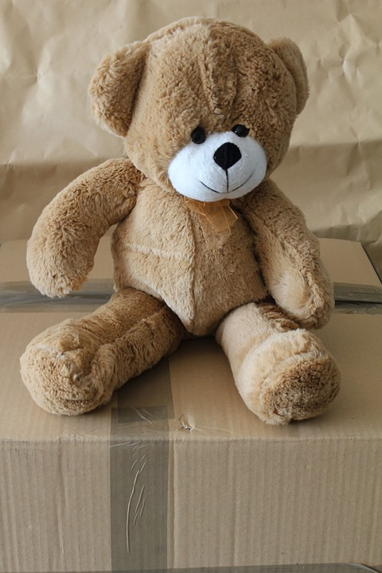

# Experiments on community model zoos

#### Tensorflow.js

[Postman](postman/TFJS%20-%20Server.postman_collection.json)

- `express` running on Node.js
- `sharp`(libvips)
- [`@tensorflow/tfjs-node`](https://github.com/tensorflow/tfjs-models/)

#### Running the server
```bash
$ cd tfjs-server
$ npm install

$ npm start
# Server listening on 3030
```

#### Running from Docker

```bash
$ cd tfjs-server
$ docker build -t incubating/tfjs-server:latest -f Dockerfile .
$ docker run -t --rm -p 3030:3030 "incubating/tfjs-server" &
# Server listening on 3030
```

**Deploy to Elastic Beanstalk**

```bash
$ brew install awsebcli
$ eb init
$ eb create
# t3.small, t2.small

$ eb deploy
```



#### Conventions

- GET route using `ìmage_url` query string or POST using multipart/form-data using the `image` field
- GET route using `message` query string or POST using `message` field in the JSON body
- [postman/](postman) contains a list of examples to try with the [Postman application](https://www.getpostman.com/)

##### tensorflow/toxicity

[Annotations conventions](https://github.com/conversationai/conversationai.github.io/blob/master/crowdsourcing_annotation_schemes/toxicity_with_subattributes.md)

```javascript
$ curl -s 'localhost:3030/v2/toxicity?text=I%20love%20seafood' | jq .
[
    {
        "label": "identity_attack",
        "results": [
            {
                "probabilities": {
                    "0": 0.9999690055847168,
                    "1": 0.000030998882721178234
                },
                "match": false
            }
        ]
    },
    {
        "label": "insult",
        "results": [
            {
                "probabilities": {
                    "0": 0.9998032450675964,
                    "1": 0.00019675538351293653
                },
                "match": false
            }
        ]
    },
    {
        "label": "obscene",
        "results": [
            {
                "probabilities": {
                    "0": 0.9999403953552246,
                    "1": 0.000059632253396557644
                },
                "match": false
            }
        ]
    },
    {
        "label": "severe_toxicity",
        "results": [
            {
                "probabilities": {
                    "0": 1,
                    "1": 2.4753488148121505e-8
                },
                "match": false
            }
        ]
    },
    {
        "label": "sexual_explicit",
        "results": [
            {
                "probabilities": {
                    "0": 0.9999597072601318,
                    "1": 0.00004024286681669764
                },
                "match": false
            }
        ]
    },
    {
        "label": "threat",
        "results": [
            {
                "probabilities": {
                    "0": 0.9999363422393799,
                    "1": 0.00006362887506838888
                },
                "match": false
            }
        ]
    },
    {
        "label": "toxicity",
        "results": [
            {
                "probabilities": {
                    "0": 0.9995335340499878,
                    "1": 0.00046650166041217744
                },
                "match": false
            }
        ]
    }
]
```

##### tensorflow/mobilenet

Classes it can predict: [imagenet classes](https://github.com/tensorflow/tfjs-examples/blob/master/mobilenet/imagenet_classes.js#L19-L1039).

```javascript
$ curl -X POST localhost:3030/v2/mobilenet
[
    {
        "className": "teddy, teddy bear",
        "probability": 0.9991821050643921
    },
    {
        "className": "hamper",
        "probability": 0.0001980842207558453
    },
    {
        "className": "toyshop",
        "probability": 0.00019572325982153416
    }
]
```

##### tensorflow/cocossd
```javascript
$ curl -X POST localhost:3030/v2/cocossd
[
    {
        "bbox": [
            13.42470794916153,
            -2.2287483513355255,
            257.27201026678085,
            252.97450867295265
        ],
        "class": "teddy bear",
        "score": 0.9690217971801758
    }
]
```

### Known issues

- `node-gyp` errors on MacOS: https://github.com/nodejs/node-gyp/blob/master/macOS_Catalina.md

### References

#### Models
- [Tensorflow / Toxicity classifier](https://github.com/tensorflow/tfjs-models/tree/master/toxicity)
- [Tensorflow / Coco SSD](https://github.com/tensorflow/tfjs-models/tree/master/coco-ssd)
- [Tensorflow / Mobilenet](https://github.com/tensorflow/tfjs-models/tree/master/mobilenet)
- [Tensorflow / USE](https://github.com/tensorflow/tfjs-models/tree/master/universal-sentence-encoder)
- [naptha/tesseract.js](https://github.com/naptha/tesseract.js)
- [lokesh/color-thief](https://github.com/lokesh/color-thief)
- [justadudewhohacks/face-api.js](https://github.com/justadudewhohacks/face-api.js)

**To be evaluated**
- [Tensorflow / Posenet](https://github.com/tensorflow/tfjs-models/tree/master/posenet)
- [Tensorflow / BodyPix](https://github.com/tensorflow/tfjs-models/tree/master/body-pix)
- [justadudewhohacks/opencv4nodejs](https://github.com/justadudewhohacks/opencv4nodejs)
